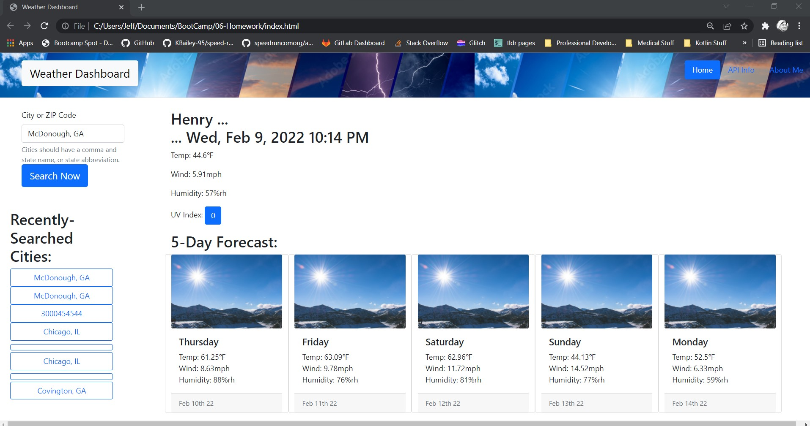
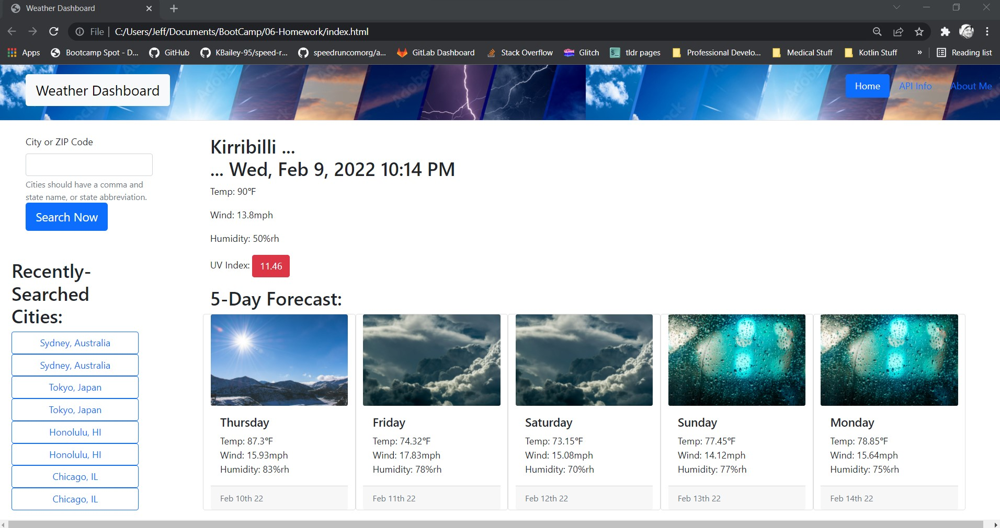
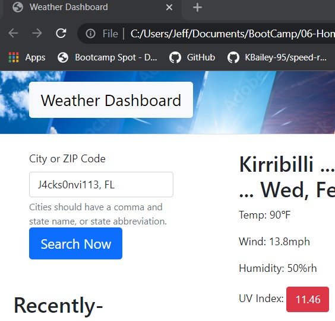
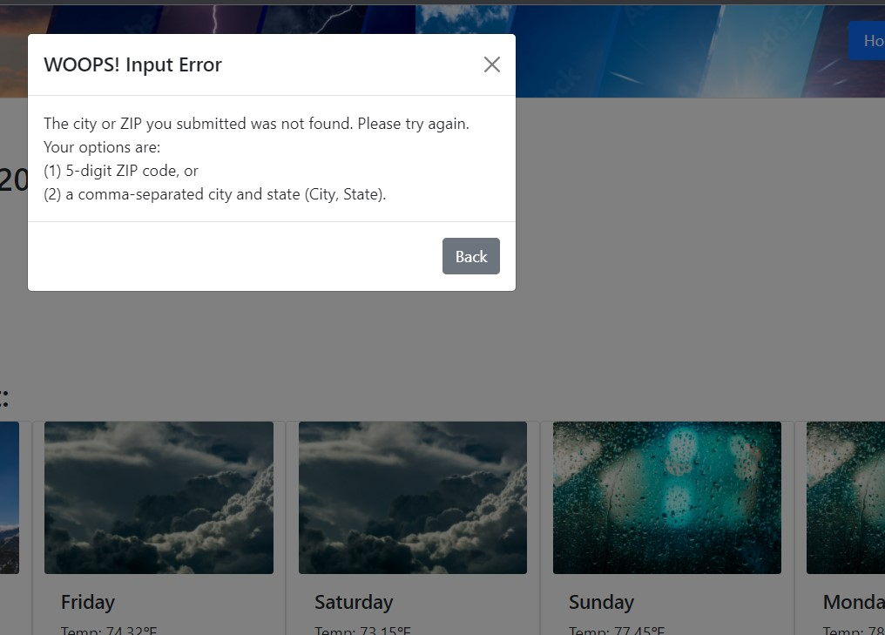

# 06-Homework
Weather Dashboard
https://patrickfham.github.io/WeatherDashboard/

## Approach

With the exception of some timing/sync issues, all the criteria are met.  I also added some functionality to the search bar, detecting whether input is a ZIP Code or a City, State... and using either scenario to get lat/long data.  From that point on, the processes are straightforward.

The user-input filter was tough for me, but it works.  Anything that doesn't look like a City, State with a comma separating, or a five-digit ZIP code, will 'throw' a modal error message, helping the user know how to revise their search terms.

Once again for this week, as previous weeks, I know there are streamlined ways to do what I did the long way.  I'll learn these things soon, hopefully... because this took a lot of time... more than I planned.

I chose to display the high-temp, high-wind, and high-humidity, rather than fast-fowarding exactly 24-hours from the user's moment.  I felt like this was much more usable information, though it certainly was more work.

The background images change to coordinate with the weather conditions of that day.
The day of the week and date are also shown here.

Local storage was used to save the eight(8)-most-recent searches, which are immediately searchable again by clicking on them.

The UV Index is color coded, as requested.  Also, I made this a button to navigate to the NWS Website for more information about the index.

Both the "Home" button and the Main Heading are links to refresh the page, but recent searches are still present and usable.

The only problem I'm having is a sync issue, where the fetch data isn't ready in time for the page to try to render.  I even added some time-delay into some functions, to buy-some-time for the fetch/response.  I'd love to learn the solution here.

## Video Demo
https://watch.screencastify.com/v/ylV6emZXBSFvgrBMQGSn

## Screenshots

